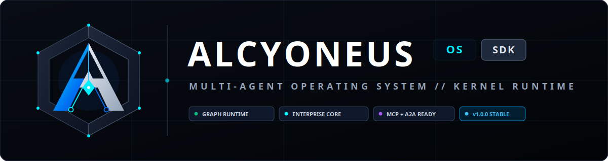

<div align="center">
  
  <p>
    <a href="https://github.com/sainibhaowal/AlcyoNeus-Web/releases/tag/v0.1.0-web"></a>&nbsp;
    <a href="https://pypi.org/project/alcyoneus/"></a>&nbsp;
    <a href="https://github.com/sainibhaowal/Alcyoneus-OS"></a>&nbsp;
    <a href="LICENSE"></a>&nbsp;
    <a href="https://nodejs.org/"></a>&nbsp;
    <a href="Dockerfile"></a>
  </p>
</div>

---

# Alcyoneus Web (`v0.1.0-web`)

**Alcyoneus Web** is the official web portal, interactive architecture explorer, and documentation hub for **[Alcyoneus OS](https://github.com/sainibhaowal/Alcyoneus-OS)** — the production-grade Python framework for building intelligent agents and orchestrating multi-agent state-graph workflows.

> **Looking for the core Python SDK?**  
> Visit the official repository: **[sainibhaowal/Alcyoneus-OS](https://github.com/sainibhaowal/Alcyoneus-OS)**  
> Or install via PyPI: `pip install alcyoneus`

---

## 🌟 What This Web App Features

- **Cyber-Titanium Design System**: Custom HSL dark-mode theme with glassmorphism, responsive grid overlays, and official brand vectors.
- **Interactive Code Architecture Explorer**: Live interactive code playground test-driving 5 core Alcyoneus OS patterns:
  - StateGraph & ReAct Agent Loops
  - Realtime Duplex Audio & Speech Barge-in (`AudioAgent`)
  - Multi-Agent Swarms with Dynamic Handoffs (`SwarmAgent`)
  - Functional Workflows (`@entrypoint` & `@task`)
  - Graph Visualizer (`alc graph visualize --format html`)
- **Interactive `alc` CLI Terminal Simulator**: Real-world CLI workflows for scaffolding (`alc graph create`), tool execution (`alc tool test`), checkpoint replay (`alc debug replay`), and containerized deployment (`alc deploy docker`).
- **9 Core Subsystem Pillars**: Detailed walkthroughs of Cyclic Routing, 9 Prebuilt Agents, Realtime Voice, Multi-Cloud Sandboxing (Docker, K8s, Firecracker, Daytona, E2B), Open Protocols (MCP, A2A, ACP), 50+ Tools, 3-Layer Persistence, Security Guardrails, and Observability.
- **Documentation Matrix**: Quick-jump directory indexing the 17+ deep-dive technical guides from `Alcyoneus_OS/docs`.
- **Micro-Interactions**: Clipboard copy buttons with checkmark animations and tooltips.

---

## 🚀 Quick Start

### Local Development

```bash
# 1. Install dependencies
npm install

# 2. Run local dev server (port 1234)
npm run dev

# Open http://localhost:1234 in your browser
```

### Production Build

```bash
# Compile optimized Next.js standalone build
npm run build

# Run unit and configuration tests
npm test
```

---

## 🐳 Docker & VPS Deployment

The application is configured for production deployment using Next.js standalone mode:

### Option A: Docker Compose (Recommended)

```bash
# Build and run detached container
docker compose up -d --build

# Inspect container logs
docker compose logs -f
```

### Option B: Native Docker

```bash
docker build -t alcyoneus_web:v0.1.0-web .
docker run -d --name alcyoneus_web -p 3000:3000 --restart unless-stopped alcyoneus_web:v0.1.0-web
```

### Option C: Automated VPS Deploy Script

```bash
chmod +x deploy.sh
./deploy.sh
```

For complete Nginx reverse proxy configuration, gzip setup, and Let's Encrypt SSL certificates, see **[VPS_DEPLOYMENT.md](VPS_DEPLOYMENT.md)**.

---

## 📂 Project Architecture

```
AlcyoNeus_Web/
├── public/                     # Brand SVG marks, favicons, banners
│   ├── alcyoneus-mark-transparent.svg
│   ├── alcyoneus-logo.svg
│   ├── banner.png
│   └── favicon.ico
├── src/
│   ├── app/
│   │   ├── layout.tsx          # SEO, OpenGraph metadata, icons
│   │   ├── page.tsx            # Main landing page assembly
│   │   └── globals.css         # Glassmorphism & Cyber-Titanium theme tokens
│   ├── components/
│   │   ├── header/Header.tsx   # Glass navbar with brand logo & links
│   │   ├── hero/Hero.tsx       # Headline, stats, quickstart & install pill
│   │   ├── features/           # 9-pillar capability grid
│   │   ├── explorer/           # Interactive tabbed code explorer
│   │   ├── cli/                # Live alc CLI terminal showcase
│   │   ├── showcase/           # Real-world examples showcase
│   │   ├── docs/               # Technical documentation directory
│   │   ├── footer/Footer.tsx   # 5-column navigation & links
│   │   └── ui/CopyButton.tsx   # Reusable animated copy button
│   └── __tests__/              # Automated test suite
├── Dockerfile                  # Multi-stage production Dockerfile (Alpine)
├── docker-compose.yml          # Container orchestration & healthchecks
├── VPS_DEPLOYMENT.md           # VPS production deployment guide
└── deploy.sh                   # Automated deployment script
```

---

## 🔗 Official Ecosystem Links

- **Alcyoneus OS Repository**: [https://github.com/sainibhaowal/Alcyoneus-OS](https://github.com/sainibhaowal/Alcyoneus-OS)
- **PyPI Package**: [https://pypi.org/project/alcyoneus/](https://pypi.org/project/alcyoneus/)
- **Documentation**: [Alcyoneus OS Docs](https://github.com/sainibhaowal/Alcyoneus-OS/tree/main/docs)
- **Examples**: [Alcyoneus OS Examples](https://github.com/sainibhaowal/Alcyoneus-OS/tree/main/examples)

---

## 📜 License

Licensed under the **Apache License, Version 2.0**. See the [LICENSE](LICENSE) file for details.

Copyright (c) 2026 Ravinder Singh (Alcyoneus OS) & Contributors / Alcyoneus Authors.
